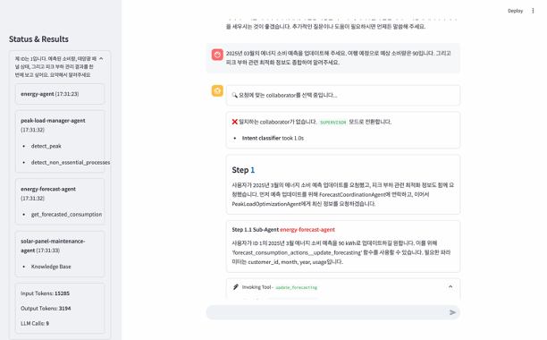

# Streamlit Demo UI

A Streamlit-based user interface that can be used with any text-based Bedrock agent by updating the `config.py` file.

## Architecture

The demo UI integrates with Amazon Bedrock Agent Runtime for agent execution and showcases multi_agent_collaboration features including:

- Dynamic routing between specialized agents
- Knowledge base lookups
- Tool invocations
- Code interpretation capabilities



## Prerequisites

1. Create a bedrock agent

2. Ensure you have:

   - Python 3.x
   - AWS credentials configured with appropriate permissions

3. Create and activate a Python virtual environment:

   ```bash
   python3 -m venv .venv
   source .venv/bin/activate
   ```

4. Install required dependencies:
   ```bash
   pip install -r requirements.txt
   ```

## Using with Any Bedrock Agent

To add your own agent:

Add a new configuration to the `bot_configs` list in `config.py`:

```python
{
    "bot_name": "Your Bot Name",  # Display name in the UI
    "agent_name": "your_agent_id", # Your Bedrock agent ID
    "start_prompt": "Initial message to show users",
    "session_attributes": {        # Optional: Include if your agent needs specific session attributes
        "sessionAttributes": {      # Custom key-value pairs for your agent's session
            "key1": "value1",
            "key2": "value2"
        },
        "promptSessionAttributes": {} # Additional prompt-specific attributes if needed
    }
}
```

## Running the Demo

1. Configure your AWS credentials with appropriate permissions

2. Run the Streamlit application:

   ```bash
   streamlit run app.py
   ```

3. Optionally, specify a specific bot using the BOT_NAME environment variable:

   ```bash
   BOT_NAME="<bot-name>" streamlit run app.py
   ```

## Usage

1. The UI will display the selected bot's interface
2. Enter your query in the chat input field
3. The agent will:
   - Process your request
   - Show the collaboration between different agents
   - Display thought processes and tool usage
   - Provide a detailed response
